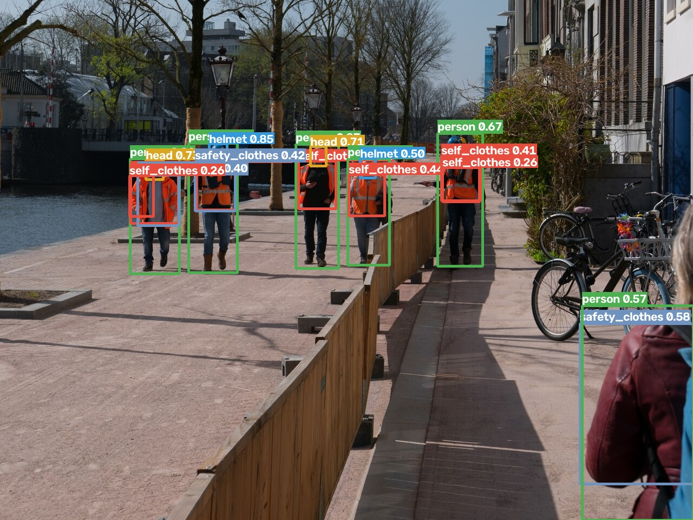
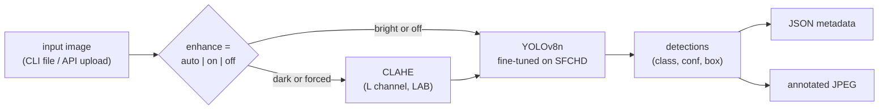

# ppe-detect

Detect personal protective equipment — helmets, safety clothing, and the people
wearing (or not wearing) them — in images, with a YOLOv8n model fine-tuned on the
SFCHD chemical-plant dataset. CPU inference, a tested CLI, and a FastAPI service.



*Out-of-domain example (CC0 street photo, not from the training set): helmets and
bare heads are separated correctly on all five workers; the pedestrian at the right
edge picks up a spurious `safety_clothes` box — see [Limitations](#limitations).*

## Quickstart

```bash
git clone https://github.com/abhipabhi/ppe-detect && cd ppe-detect
python3 -m venv .venv && source .venv/bin/activate && pip install -r requirements.txt && pip install -e .
python scripts/get_weights.py                      # sha256-verified release download
uvicorn --factory ppe_detect.api:create_app &  \
  curl -F image=@assets/sample.jpg "localhost:8000/detect?enhance=auto"
```

## Results

YOLOv8n, 25 epochs on Apple-Silicon MPS, evaluated on the 2,475-image held-out
SFCHD val split ([full provenance](results/metrics.md)):

<!-- table:standard:start -->
| Class | Precision | Recall | mAP50 | mAP50-95 |
|---|---|---|---|---|
| person | 0.924 | 0.940 | 0.961 | 0.701 |
| helmet | 0.898 | 0.898 | 0.921 | 0.596 |
| self_clothes | 0.681 | 0.703 | 0.768 | 0.540 |
| safety_clothes | 0.885 | 0.927 | 0.942 | 0.622 |
| head | 0.782 | 0.738 | 0.736 | 0.376 |
| blur_head | 0.720 | 0.388 | 0.426 | 0.200 |
| blur_clothes | 0.653 | 0.397 | 0.468 | 0.279 |
| all | 0.792 | 0.713 | 0.746 | 0.473 |
<!-- table:standard:end -->

For reference, the SFCHD authors report 77.9 mAP50 for YOLOv8 trained 200 epochs
on the same dataset ([paper](https://github.com/lijfrank-open/SFCHD-SCALE)); this
model reaches 74.6 in 25 epochs (~5.8 h on a laptop).

## Classes

The model predicts exactly the 7 published SFCHD classes, unchanged:
`person`, `helmet`, `self_clothes` (non-safety clothing), `safety_clothes`,
`head` (bare head), `blur_head`, `blur_clothes`.

There is **no vest, gloves, or boots class** — SFCHD does not annotate them;
safety clothing is the closest available signal.

## Architecture



- **Model**: YOLOv8n (3.2 M params), fine-tuned from COCO weights on SFCHD
  (12,372 CCTV images, 80/20 split), imgsz 640, seed 42.
- **Low-light option**: CLAHE on the LAB lightness channel, gated by mean
  brightness in `auto` mode. Measured effect below.
- **Serving**: FastAPI app factory; the model loads once at startup (lifespan
  hook). `GET /healthz` reports the served weights' sha256.

## Low-light: measured, not assumed

A pre-registered A/B on the val split, synthetically darkened with fixed-seed
per-image gamma (protocol in [results/metrics.md](results/metrics.md)):

<!-- table:ab:start -->
| Class | mAP50 dark | mAP50 dark+CLAHE | Δ mAP50 | mAP50-95 dark | mAP50-95 dark+CLAHE | Δ mAP50-95 |
|---|---|---|---|---|---|---|
| person | 0.911 | 0.923 | +0.013 | 0.633 | 0.646 | +0.013 |
| helmet | 0.844 | 0.853 | +0.009 | 0.509 | 0.505 | -0.004 |
| self_clothes | 0.626 | 0.637 | +0.011 | 0.443 | 0.437 | -0.006 |
| safety_clothes | 0.887 | 0.896 | +0.009 | 0.549 | 0.553 | +0.004 |
| head | 0.603 | 0.585 | -0.018 | 0.305 | 0.294 | -0.011 |
| blur_head | 0.318 | 0.291 | -0.027 | 0.153 | 0.129 | -0.024 |
| blur_clothes | 0.308 | 0.342 | +0.034 | 0.181 | 0.205 | +0.024 |
| all | 0.642 | 0.647 | +0.004 | 0.396 | 0.395 | -0.001 |
<!-- table:ab:end -->

Darkening costs ~10 mAP50 points overall; CLAHE recovers **+0.4 points — close to
neutral**, with small gains on the major classes and losses on the small blurred
classes. CLAHE is therefore an option (`enhance=auto|on|off`), not a claim.

## Usage

### CLI

```bash
ppe-detect image.jpg --weights weights/ppe-detect-y8n-sfchd.pt
ppe-detect image.jpg -o out.jpg --json out.json --conf 0.4 --enhance auto
```

### API

```bash
uvicorn --factory ppe_detect.api:create_app --port 8000
```

```bash
curl -F image=@x.jpg "localhost:8000/detect"                # JSON: boxes/classes/confidences/timing
curl -F image=@x.jpg "localhost:8000/detect?output=image" -o out.jpg   # annotated JPEG
curl localhost:8000/healthz                                  # weights name + sha256
```

Bad input returns JSON errors, never a 500: non-image/corrupt/empty upload → 400,
payload over `PPE_MAX_UPLOAD_MB` (default 10) → 413, invalid params → 422.
Weights path override: `PPE_WEIGHTS`.

## Reproduce

```bash
python scripts/prepare_data.py    # assemble dataset + image/label reconciliation report
python scripts/train.py --epochs 25 --batch 16 --device mps --name sfchd-y8n
python scripts/evaluate.py        # regenerates results/metrics.md (eval + low-light A/B)
python scripts/sync_readme.py     # copies result tables into this README
```

The SFCHD images are downloaded from the dataset authors' public link (see
`CLAUDE.md` dataset record for URL and archive sha256); `prepare_data.py` verifies
every image has a matching label file and fails on >2% orphans.

## Tests

```bash
pytest                 # fast tests, stubbed model — no weights needed
pytest -m integration  # end-to-end with real weights (CLI + API)
```

## Limitations

- **Domain gap**: trained only on fixed-viewpoint chemical-plant CCTV. On other
  imagery (close-ups, street photos) confidence drops and clothing classes
  confuse more easily — visible in the hero image above.
- **Low-light enhancement is near-neutral**: the pre-registered A/B shows CLAHE
  recovers only +0.004 mAP50 on darkened images. It is exposed as an option, not
  a performance feature.
- **Blurred classes are weak**: blur_head 0.43 / blur_clothes 0.47 mAP50 — tiny,
  motion-blurred instances; consistent with the dataset paper's own baselines.
- **Single dataset**: no cross-dataset evaluation; the 7-class schema is
  SFCHD-specific (no vest/gloves/boots).

## Future work

- Learned low-light enhancement (SCALE-style attention module from the SFCHD
  paper) instead of histogram-based CLAHE.
- Dark-domain fine-tuning: include synthetically darkened images in training
  rather than only enhancing at inference.
- Cross-dataset evaluation (e.g. hard-hat datasets) to quantify the domain gap.

## Weights provenance

Weights: [`weights-v1` release](https://github.com/abhipabhi/ppe-detect/releases/tag/weights-v1),
sha256 `ed20fd001d5dfef61c738928c799201d3323f2c5148e3d0dfa0c521263d28870`
(verified by `scripts/get_weights.py` and reported live by `/healthz`).

Trained on the **SFCHD** dataset — Yu, Li, et al. (HUST), *"Large, Complex, and
Realistic Safety Clothing and Helmet Detection: Dataset and Method"* (IEEE T-ASE),
[github.com/lijfrank-open/SFCHD-SCALE](https://github.com/lijfrank-open/SFCHD-SCALE).
The dataset carries no explicit license; the weights are shared for research and
evaluation with credit to the dataset authors — commercial users should verify
dataset rights independently. No dataset images are redistributed in this repo;
committed sample images are CC0 ([attribution](assets/ATTRIBUTION.md)).

Code: [MIT](LICENSE).
